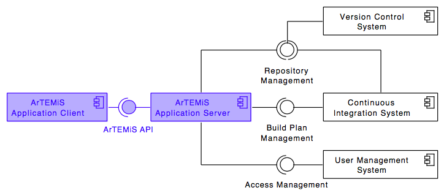

# Artemis: Interactive Learning with Individual Feedback 


This application was generated using JHipster 6.1.2, you can find documentation and help at [http://www.jhipster.tech/documentation-archive/v6.1.2](http://www.jhipster.tech/documentation-archive/v6.1.2).

**Current version:** 3.4.0

## Main features
Artemis supports the following exercises:
1. **[Programming exercises](/doc/exerciseTypes/programmingExercise/PROGRAMMING_EXERCISE.md)** with version control and automatic assessment with test cases and continuous integration
2. **Quiz exercises** with multiple choice, drag and drop and short answer quiz questions 
3. **Modeling exercises** with semi-automatic assessment using machine learning concepts
4. **Text exercises** with manual assessment

All these exercises are supposed to be run either live in the lecture with instant feedback or as homework. Students can submit their solutions multiple times within the due date and use the (semi-)automatically provided feedback to improve their solution.

## Development setup

Find here a guide on [how to set up your local development environment](/doc/setup/SETUP.md).

## Contributing 

Find here a guide on [how to contribute](/doc/contribute/CONTRIBUTE.md) to Artemis.

## Top-Level Design

The following diagram shows the top-level design of Artemis which is decomposed into an application client (running as Angular web app in the browser) and an application server (based on Spring Boot). For programming exercises, the application server connects to a version control system (VCS) and a continuous integration system (CIS). Authentication is handled by an external user management system (UMS).



While Artemis includes generic adapters to these three external systems with a defined protocol that can be instantiated to connect to any VCS, CIS or UMS, it also provides 3 concrete implementations for these adapters to connect to:

1. **VCS:** Atlassian Bitbucket Server
2. **CIS:** Atlassian Bamboo Server
3. **UMS:** Atlassian JIRA Server (more specifically Atlassian Crowd on the JIRA Server)

## Building for production

To optimize the Artemis application for production, run:

```
./gradlew -Pprod -Pwar clean bootWar
```

This will compile the TypeScript into JavaScript files, concatenate and minify them and the CSS files. It will also modify `index.html` so it references these new files. To ensure everything worked, run:

```
java -jar build/libs/*.war
```

Then navigate to [http://localhost:8080](http://localhost:8080) in your browser.

Refer to [Using JHipster in production](http://www.jhipster.tech/production) for more details.

## Deployment

The following UML deployment diagram shows a typical deployment of Artemis application server and application client. Student, Instructor and Teaching Assistant (TA) computers are all equipped equally with the Artemis application client being displayed in the browser.

The Continuous Integration Server typically delegates the build jobs to local build agents within the university infrastructure or to remote build agents, e.g. hosted in the Amazon Cloud (AWS).


## Data Model

The Artemis application server used the following data model in the MySQL database.  It supports multiple courses with multiple exercises. Each student in the participating student group can participate in the exercise by clicking the **Start Exercise** button. Then a repository and a build plan for the student (User) will be created and configured. The initialization state variable (Enum) helps to track the progress of this complex operation and allows to recover from errors. A student can submit multiple solutions by committing and pushing the source code changes to a given example code into the version control system or using the user interface. Each submission is automatically tested by the continuous integration server, which notifies the Artemis application server, when a new result exists. In addition, teaching assistants can assess student solutions and "manually" create results.
The current data model is more complex and supports different types of exercises such as programming exercises, modeling exercises, quiz, and text exercises.


## Server Architecture

The following UML component diagram shows more details of the Artemis application server architecture and its REST interfaces to the application client.


