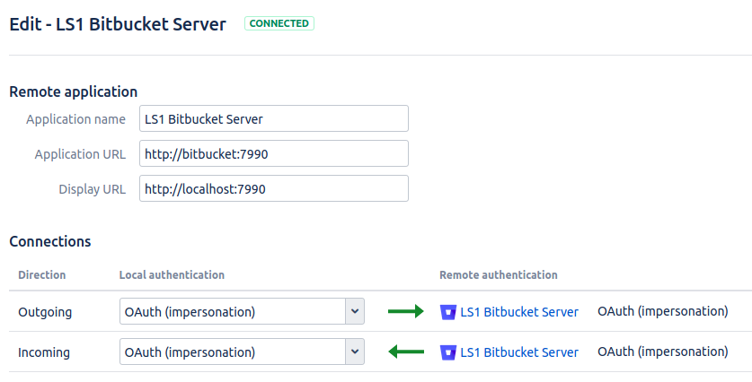
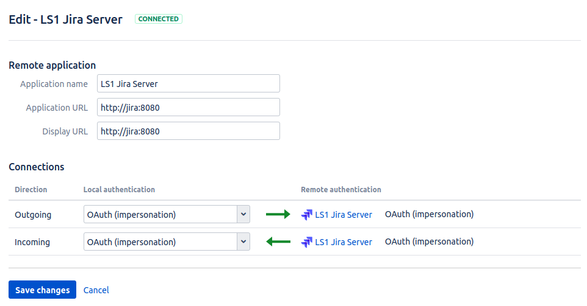
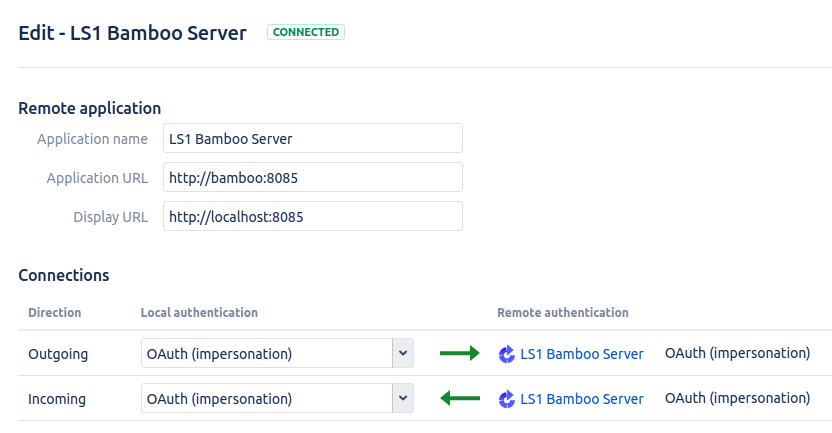
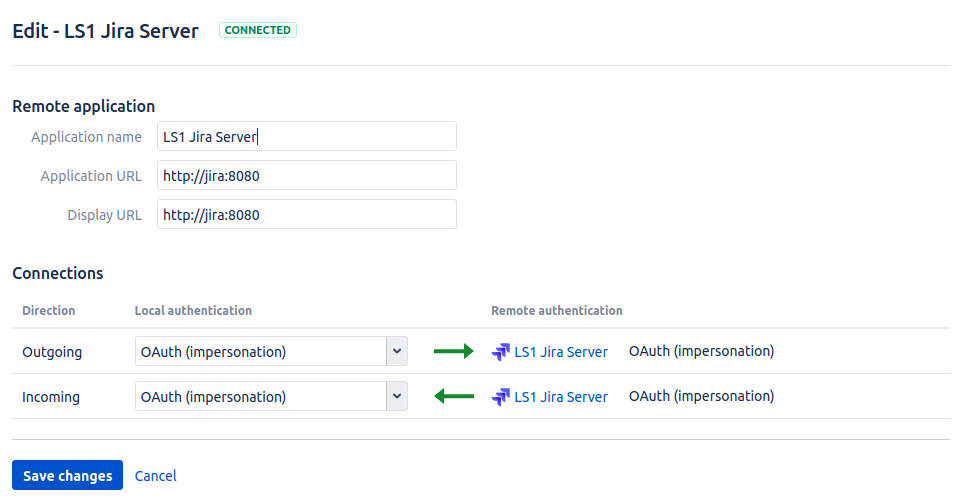
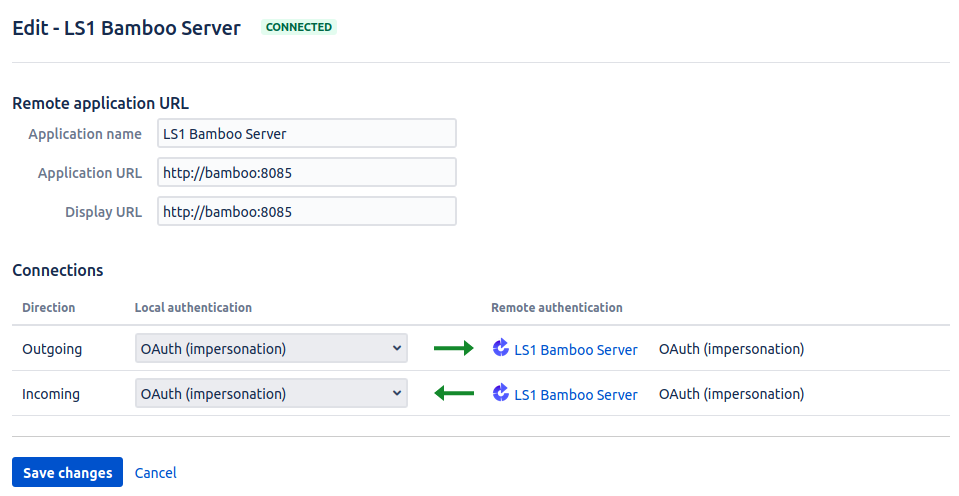
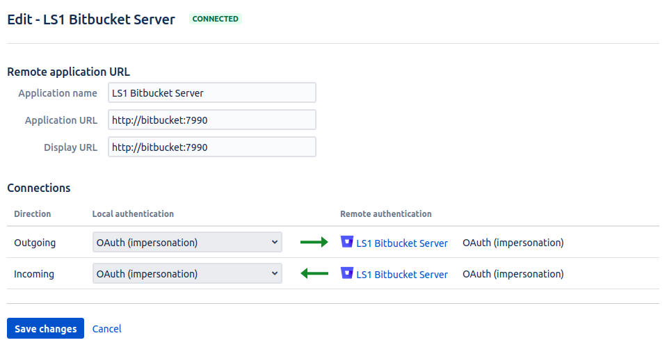
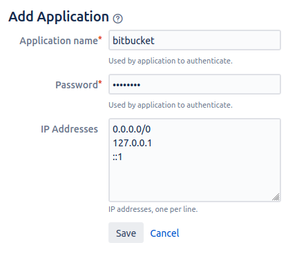
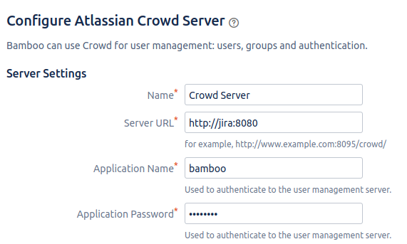

# Setup for Programming Exercises with Bamboo, Bitbucket and Jira

This page describes how to set up a programming exercise environment based on Bamboo, Bitbucket and Jira. 

Please note that this setup will create a deployment that is very similiar to the one used in production but has one difference:  
In production, the builds are performed within Docker containers that are created by Bamboo (or its build agents). As we run Bamboo in a Docker container in this setup, creating new Docker containers within that container is not recommended (e.g. see [this article](https://itnext.io/docker-in-docker-521958d34efd)).
There are some solution where one can pass the Docker socket to the Bamboo container, but none of these approachs work quite well here as Bamboo uses mounted directories that cause issues.

Therefor, a check is included within the BambooBuildPlanService that ensures that builds are not started in Docker agents if the development setup is present.

**Prerequisites:** 
* [Docker](https://docs.docker.com/install)
* [Docker-Compose](https://docs.docker.com/compose/install/)

# Content of this document

1. [Start Docker-Compose](#docker-compose)
2. [Configure Bamboo, Bitbucket and Jira](#configure-bamboo-bitbucket-and-jira)
3. [Configure Artemis](#configure-artemis)


## Docker-Compose

Before you start the docker-compose, check if the bamboo version in the `build.gradle` (search for `com.atlassian.bamboo:bamboo-specs`) is equal to the bamboo version number in the Dockerfile of bamboo stored in `src/main/docker/bamboo/Dockerfile`.
If the version number is not equal adjust the version number in the Dockerfile.

Execute the docker-compose file `atlassian.yml` stored in `src/main/docker` e.g. with `docker-compose -f src/main/docker/atlassian.yml up -d`

Error Handling:
It can happen that there is an overload with other docker networks `ERROR: Pool overlaps with other one on this address space`.
Use the command `docker network prune` to resolve this issue.

## Configure Bamboo, Bitbucket and Jira
By default, the Jira instance is reachable under `localhost:8081`, the Bamboo instance under `localhost:8085` and the Bitbucket instance under `localhost:7990`.

**Get evaluation licenses for Atlassian products:** [Atlassian Licenses](https://my.atlassian.com/license/evaluation)


1. Create an admin user with the same credentials in all 3 applications. Create a sample project in Jira. Also, you can select the evaluation/internal/test/dev setups if you are asked. Select a `Bitbucket (Server)` license if asked. Do not connect Bitbucket with Jira yet.
2. Execute the shell script `atlassian-setup.sh` in the `src/main/docker` directory (e.g. with `src/main/docker/./atlassian-setup.sh`). This script creates groups, users (~~and adds them to
the created groups~~ NOT YET) and disabled application links between the 3 applications   
3. Enable the created [application links](https://confluence.atlassian.com/doc/linking-to-another-application-360677690.html) between all 3 application (OAuth Impersonate). **You manually have to adjust the Display URL for the Bamboo->Bitbucket AND Bitbucket->Bamboo URl to `http://localhost:7990` and `http://localhost:8085`**
    
    <details><summary>Screenshot</summary>
    
    Bamboo:   
   
    
    
    
    Bitbucket:
    
    
    
    
    Jira:
    
    
    
    
    </details>
4. The script has already created users and groups but you need to manually assign the users into their respective group in Jira. In our test setup, users 1-5 are students, 6-10 are tutors and 11-15 are instructors.
5. Use the [user directories in Jira](https://confluence.atlassian.com/adminjiraserver/allowing-connections-to-jira-for-user-management-938847045.html) to synchronize the users in bitbucket and bamboo: 
  * Go to Jira → User management → Jira user server → Add application → Create one application for bitbucket and one for bamboo → add the IP-address `0.0.0.0/0` to IP Addresses
  
  <details><summary>Screenshot</summary>
     
  
     
  </details>
   
  * Go to Bitbucket and Bamboo → User Directories → Add Directories → Atlassian Crowd → use the URL `http://jira:8080` as Server URL → use the application name and password which you used in the previous step. Also, you should decrease the synchronisation period (e.g. to 2 minutes). Press synchronise after adding the directory, the users and groups should now be available.
  <details><summary>Screenshot</summary>
     
  
     
  </details>
  
6\. In Bamboo create a global variable named <b>SERVER_PLUGIN_SECRET_PASSWORD</b>, the value of this variable will be used as the secret. The value of this variable
should be then stored in `src/main/resources/config/application-artemis.yml` as the value of `artemis-authentication-token-value`.

7\. Download the [bamboo-server-notifaction-plugin](https://github.com/ls1intum/bamboo-server-notification-plugin/releases) and add it to bamboo.
Go to Bamboo → Manage apps → Upload app → select the downloaded .jar file → Upload

8\. Add Maven and JDK:

  * Go to Bamboo → Server capabilities → Add capabilities menu →  Capability type `Executable` → select type `Maven 3.x` → insert `Maven 3` as executable label → insert `/usr` as path. 
   
  * Add capabilities menu → Capability type `JDK` → insert `JDK 12` as JDK label → insert `/usr/lib/jvm/java-14-oracle` as Java home.
  
## Configure Artemis

1. Modify `src/main/resources/config/application-artemis.yml`

    ```artemis:
        repo-clone-path: ./repos/
        repo-download-clone-path: ./repos-download/
        encryption-password: artemis-encrypt     # arbitrary password for encrypting database values
        user-management:
            use-external: true
            external:
                url: http://localhost:8081
                user:  <jira-admin-user>
                password: <jira-admin-password>
                admin-group-name: <group name which is used in all three applications(Bitbucket,Bamboo,Jira)>
            internal-admin:
                username: artemis_admin
                password: artemis_admin            
        version-control:
            url: http://localhost:7990
            user:  <bitbucket-admin-user>
            password: <bitbuckt-admin-password>
        continuous-integration:
            url: http://localhost:8085
            user:  <bamboo-admin-user>
            password: <bamboo-admin-password>
            vcs-application-link-name: LS1 Bitbucket Server
            empty-commit-necessary: true
            artemis-authentication-token-value: <artemis-authentication-token-value>

2. Modify the application-dev.yml


    server:
    port: 8080                                         # The port of artemis
    url: http://172.20.0.1:8080                        # needs to be an ip
    
In addition, you have to start Artemis with the profiles `bamboo`, `bitbucket` and `jira` so that the correct adapters will be used, e.g.:

    --spring.profiles.active=dev,bamboo,bitbucket,jira,artemis

Please read [Development Setup](doc/setup/SETUP.md) for more details.


### How to verify the connection works?
#### Artemis -> Jira
You can login to Artemis with the admin user you created in Jira
#### Artemis -> Bitbucket
You can create a programming exercise
#### Artemis -> Bamboo
You can create a programming exercise
#### Bitbucket -> Bamboo
The build of the students repository gets started after pushing to it
#### Bitbucket -> Artemis
When using the code editor, after clicking on "Submit", the text `Building and testing...` should appear.
#### Bamboo -> Artemis
The build result is displayed in the code editor.
