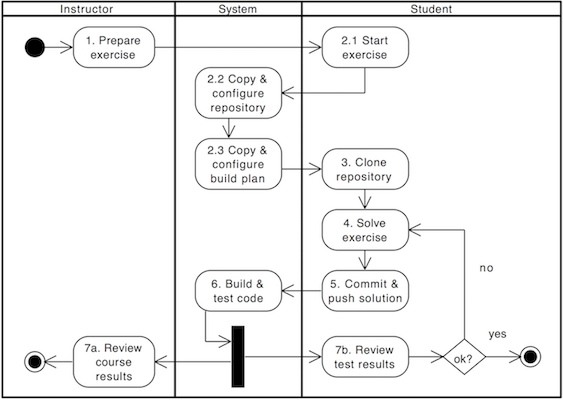
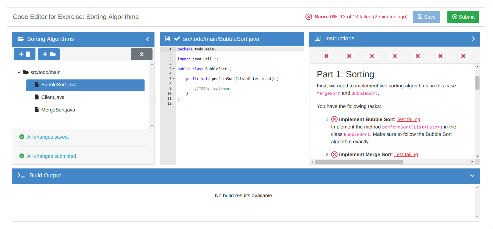

## Programming Exercise Workflow

Conducting a programming exercise consists of 7 steps distributed among instructor, Artemis and students:

1. **Instructor prepares exercise:** Set up a repository containing the exercise code and test cases, build instructions on the CI server, and configures the exercise in Artemis.
2. **Student starts exercise:** Click on start exercise on Artemis which automatically generates a copy of the repository with the exercise code and configures a build plan accordingly.
3. **Optional: Student clones repository:** Clone the personalized repository from the remote VCS to the local machine.
4. **Student solves exercise:** Solve the exercise with an IDE of choice on the local computer or in the online editor.
5. **Student uploads solution:** Upload changes of the source code to the VCS by committing and pushing them to the remote server (or by clicking submit in the online editor).
6. **CI server verifies solution:** verify the student's submission by executing the test cases (see step 1) and provide feedback which parts are correct or wrong.
7. **Student reviews personal result:** Reviews build result and feedback using Artemis. In case of a failed build, reattempt to solve the exercise (step 4).
8. **Instructor reviews course results:** Review overall results of all students, and react to common errors and problems.

The following activity diagram shows this exercise workflow. 



## Online Editor

The following screenshot shows the online code editor with interactive and dynamic exercise instructions on the right side.
Tasks and UML diagram elements are referenced by test cases and update their color from red to green after students submit a new version and all test cases associated with a task or diagram element pass.
This allows the students to immediately recognize which tasks are already fulfilled and is particularly helpful for programming beginners.



## Using adapters to support multiple VCS 

The following UML component diagram shows the details of the Version Control Adapter that allows to connect to multiple Version Control Systems. The other adapters for Continuous Integration and User Management have a similar structure


The **Version Control Adapter** includes abstract interface definitions. Among others, concrete connectors have to implement the following methods:

```
+ copyRepository(baseRepository, user)
+ configureRepository(repository, user)
+ deleteRepository(repository)
+ getRepositoryWebUrl(repository)
+ ...
```

The **Continuous Integration Adapter** includes abstract interface definitions. Among others, concrete connectors have to implement the following methods:

```
+ copyBuildPlan(baseBuildPlan, user)
+ configureBuildPlan(buildPlan, repository, user)
+ deleteBuildPlan(buildPlan)
+ onBuildCompleted(buildPlan)
+ getBuildStatus(buildPlan)
+ getBuildDetails(buildPlan)
+ ...
```
