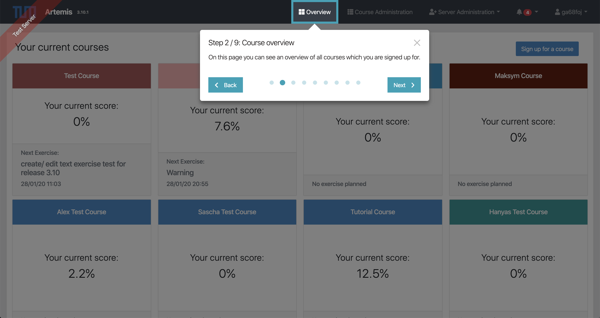
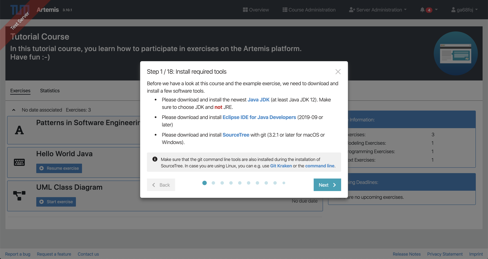
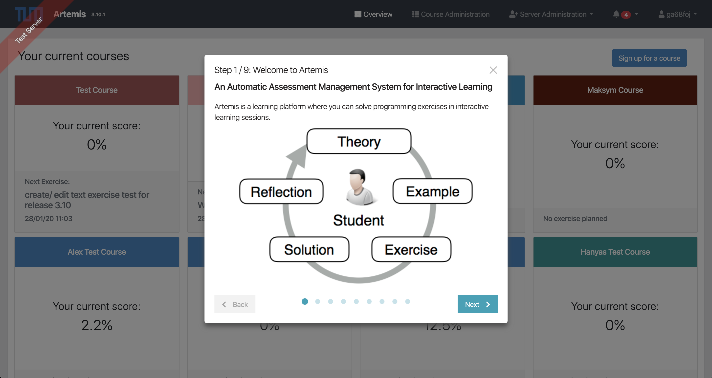
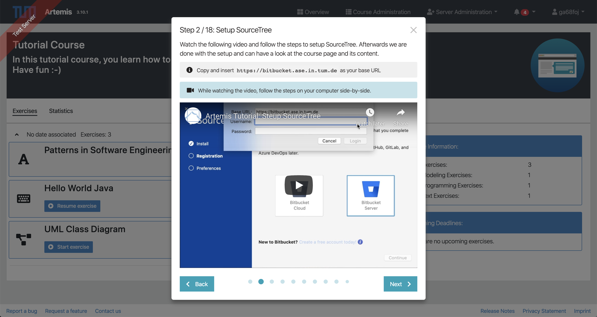
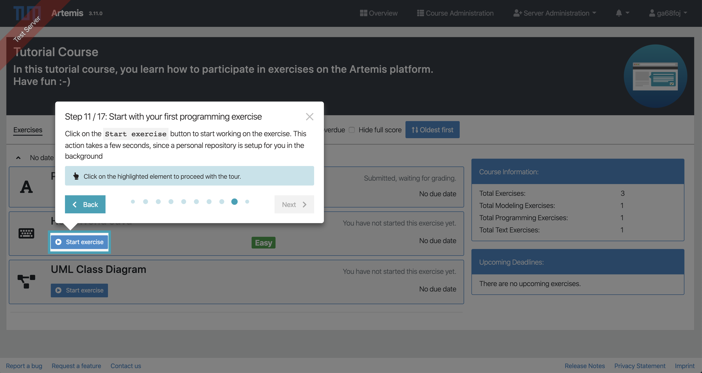
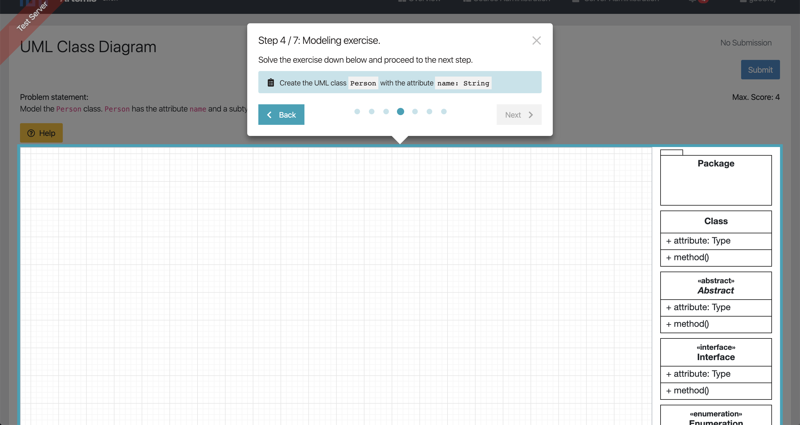
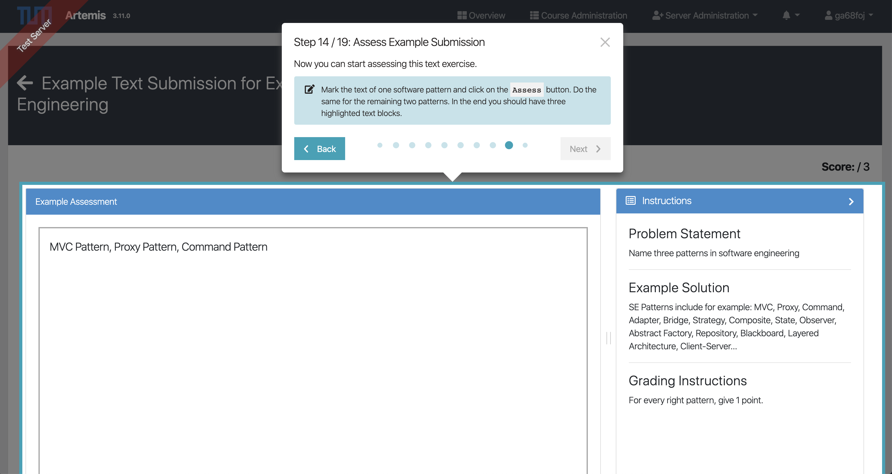

## Setup Guide for Guided Tutorials in Artemis

This guide gives you instructions on how to setup and create guided tutorials for Artemis:

### Create GuidedTour object
A guided tutorial can be created by instantiating a `GuidedTour` object.
This object has the mandatory attributes `settingsKey`, the identifier for the tutorial which will be stored in the database, and `steps`, which is an array that stores all tutorial steps.
A tutorial can have different types of tutorial steps: 
1. `TextTourStep`: tutorial step with only text content 
2. `ImageTourStep`: tutorial step with text content and embedded image
3. `VideoTourStep`: tutorial step with text content and embedded video
4. `UserInteractionTourStep`: tutorial step which requires a certain interaction from the user to proceed to the next step.
5. `ModelingTaskTourStep`: tutorial step with text content and modeling task for the Apollon editor that is assessed for the step
6. `AssessmentTaskTourStep`: tutorial step with text content and a tutor assessment task for example submissions (currently only implemented for text assessments).

###### TextTourStep with highlighted element

###### TextTourStep with multiple markdown elements

###### ImageTourStep

###### VideoTourStep

###### UserInteractionTourStep

###### ModelingTaskTourStep

###### ModelingTaskTourStep



### Example implementation of a GuidedTour object
In this example, the `GuidedTour` object is created and assigned to the constant `exampleTutorial`, which one can use to embed the tutorial to a component of choice.

```typescript
import { Orientation, UserInteractionEvent } from '../../src/main/webapp/app/guided-tour/guided-tour.constants';
import { GuidedTour } from '../../src/main/webapp/app/guided-tour/guided-tour.model';
import { ImageTourStep, ModelingTaskTourStep, TextTourStep, VideoTourStep } from '../../src/main/webapp/app/guided-tour/guided-tour-step.model';
import { GuidedTourModelingTask, personUML } from '../../src/main/webapp/app/guided-tour/guided-tour-task.model';

export const exampleTutorial: GuidedTour = {
    settingsKey: 'example_tutorial',
    steps: [
        new TextTourStep({
            highlightSelector: '#overview-menu',
            headlineTranslateKey: 'tour.courseOverview.overviewMenu.headline',
            contentTranslateKey: 'tour.courseOverview.overviewMenu.content',
            highlightPadding: 10,
            orientation: Orientation.BOTTOM,
        }),
        new ImageTourStep({
            headlineTranslateKey: 'tour.courseOverview.welcome.headline',
            subHeadlineTranslateKey: 'tour.courseOverview.welcome.subHeadline',
            contentTranslateKey: 'tour.courseOverview.welcome.content',
            imageUrl: 'https://ase.in.tum.de/lehrstuhl_1/images/teaching/interactive/InteractiveLearning.png',
        }),
        new VideoTourStep({
            headlineTranslateKey: 'tour.courseExerciseOverview.installPrerequisites.sourceTreeSetup.headline',
            contentTranslateKey: 'tour.courseExerciseOverview.installPrerequisites.sourceTreeSetup.content',
            hintTranslateKey: 'tour.courseExerciseOverview.installPrerequisites.sourceTreeSetup.hint',
            videoUrl: 'tour.courseExerciseOverview.installPrerequisites.sourceTreeSetup.videoUrl',
        }),
        new ModelingTaskTourStep({
            highlightSelector: 'jhi-modeling-editor .modeling-editor .modeling-editor',
            headlineTranslateKey: 'tour.modelingExercise.executeTasks.headline',
            contentTranslateKey: 'tour.modelingExercise.executeTasks.content',
            highlightPadding: 5,
            orientation: Orientation.TOP,
            userInteractionEvent: UserInteractionEvent.MODELING,
            modelingTask: new GuidedTourModelingTask(personUML.name, 'tour.modelingExercise.executeTasks.personClass'),
        }),
        // ...
    ],
};
```

### Mandatory attributes
1. `TextTourStep`: The mandatory fields are `headlineTranslateKey` and `contentTranslateKey`.
2. `ImageTourStep`: The ImageTourStep extends the TextTourStep and has `imageUrl` as an additional mandatory attribute. 
3. `VideoTourStep`: The VideoTourStep extends the TextTourStep and has `videoUrl` as an additional mandatory attribute.
4. `UserInterActionTourStep`: The UserInterActionTourStep extends the TextTourStep and is used to include interactions tasks for the user during the tour step. It has the additional mandatory attribute `userInteractionEvent`, which defines the interaction type, and the optional attribute `triggerNextStep`. 
5. `ModelingTaskTourStep`: The ModelingTaskTourStep extends the UserInterActionTourStep and has `modelingTask` as an additional mandatory attribute.
6. `AssessmentTaskTourStep`: The AssessmentTaskTourStep extends the UserInterActionTourStep and has `assessmentTask` as an additional mandatory attribute.

### Optional attributes`
There are many optional attributes that can be defined for a tour step. These attributes and their definition can be found in the `abstract class TourStep`.
Below, you can find a list of attributes that are used more often:
1. `highlightSelector`: For the `highlightSelector` you have to enter a CSS selector for the HTML element that you want to highlight for this step.   
2. `orientation`: We can define an orientation for every tour step individually. The tour step orientation is used to define the position of the tour step next to highlighted element.
3. `highlightPadding`: This attribute sets the additional padding around the highlight element.
4. `userInteractionEvent`: Some steps require user interactions, e.g. certain click events, before the next tour step can be enabled. The supported user interactions are defined in the enum `UserInteractionEvent`.
5. `pageUrl`: If you want to create a multi-page tutorial, i.e. a tutorial that guides the user through multiple component pages, then you have to use this attribute. The `pageUrl` should be added to the first tutorial step of every page and if the URL has identifiers in the URL such as course or exercise ids then these numbers should be replaced with the regex `(\d+)+`. An example of multi-page tutorials can be found in the `tutor-assessment-tour.ts` file.   

### Add translations
In order to allow internationalization, the values for the attributes `headlineTranslateKey`, `subHeadlineTranslateKey`, `contentTranslateKey` and `hintTranslateKey` reference the text snippets which are stored in JSON translation document.
Further attributes that need translations are `videoUrl` for `VideoTourStep` and `taskTranslateKey` for the `modelingTask` in the `ModelingTaskTourStep`. 
One JSON document that is used for the translations of guided tutorials is the file `guidedTour.json`. 

### Embed in component file
There are multiple service methods to embed a guided tutorial in an application component file.
We use the GuidedTutorialService in the component through dependency injection and invoke the fitting method to enable the tutorial for the component:

The `enableTourForCourseOverview` method is used when the tutorial should be enabled for a certain course in a component, which displays a list of courses (e.g. `overview.component.ts`). 
It returns the course for which the tutorial is enabled, if available, otherwise null.
```
public enableTourForCourseOverview(courses: Course[], guidedTour: GuidedTour, init: boolean): Course | null {
```

The `enableTourForCourseExerciseComponent` method is used when the tutorial should be enabled for a certain course and exercise in a component, which displays a list of exercises for a course (e.g. `course-exercises.component.ts`). 
It returns the exercise for which the tutorial is enabled, if available, otherwise null.
```
public enableTourForCourseExerciseComponent(course: Course | null, guidedTour: GuidedTour, init: boolean): Exercise | null {
```

The `enableTourForExercise` method is used when the tutorial should be enabled for a certain exercise (e.g. `course-exercise-details.component.ts`). 
It returns the exercise for which the tutorial is enabled, if available, otherwise null.
```
public enableTourForExercise(exercise: Exercise, guidedTour: GuidedTour, init: boolean) {
```

#### Example of integrating the GuidedTour `exampleTutorial` into a component file
```
constructor( private guidedTourService: GuidedTourService ) {}
...
this.courseForGuidedTour = this.guidedTourService.enableTourForCourseOverview(this.courses, exampleTutorial, true);
```

### Extend configuration file
The mapping of guided tutorials to certain courses and exercises is configured in the `application-dev.yml` and `application-prod.yml` files.
The yaml configuration below shows that the guided tutorials are only enabled for the course with the short name `artemistutorial`.
The configuration for `tours` shows a list of mappings `tutorialSettingsKey` -> `exerciseIdentifier`. The `exerciseIdentifier` for programming exercises is the exercise short name, otherwise it's the exercise title.

```yaml
info:
    guided-tour:
        courseShortName: 'artemistutorial'
        tours:
            - cancel_tour: ''
            - code_editor_tour: 'tutorial'
            - course_overview_tour: ''
            - course_exercise_overview_tour: 'tutorial'
            - modeling_tour: 'UML Class Diagram'
            - programming_exercise_fail_tour: 'tutorial'
            - programming_exercise_success_tour: 'tutorial'
            - tutor_assessment_tour: 'Patterns in Software Engineering'
```

