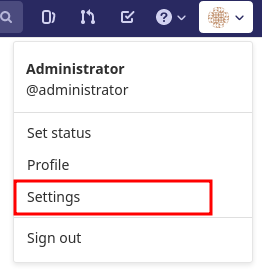
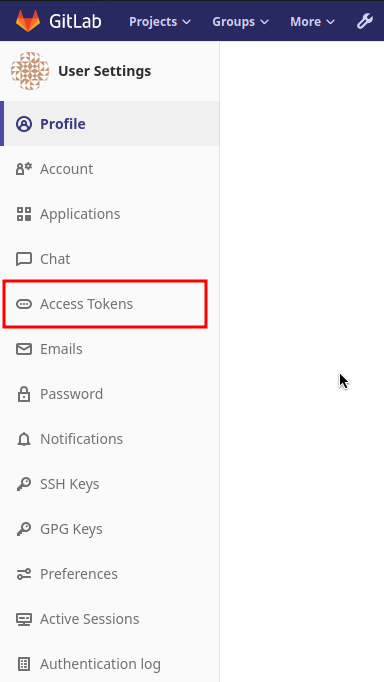
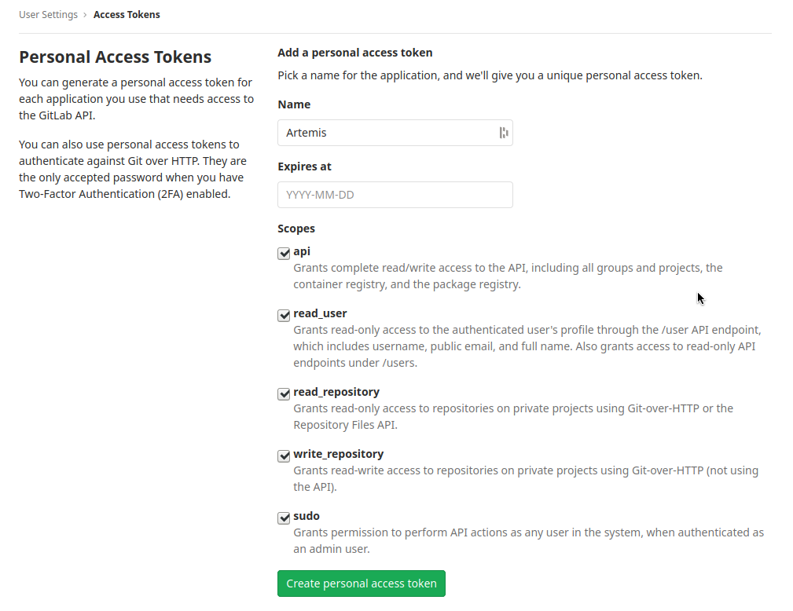
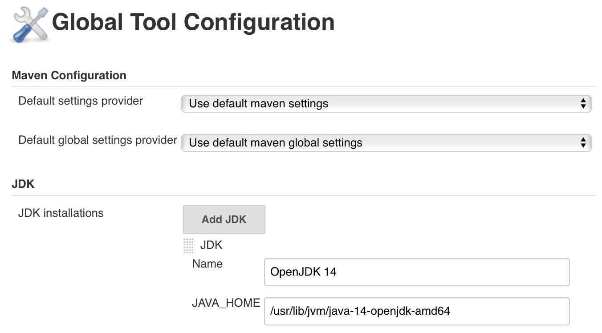
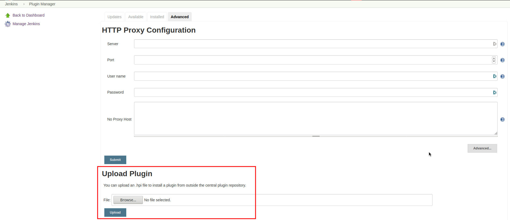
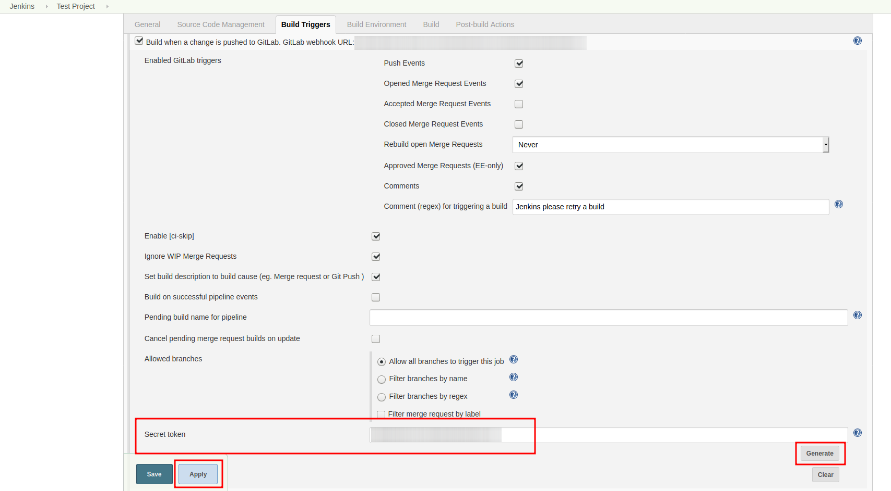
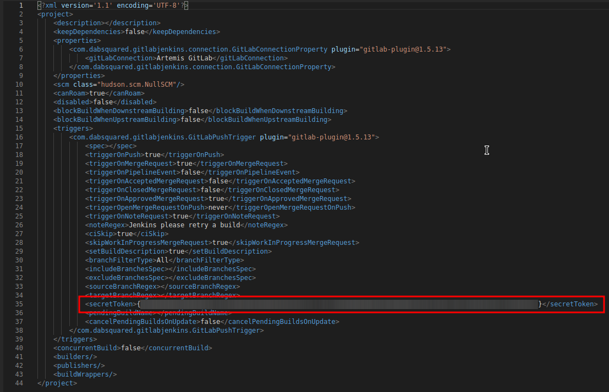

# Setup for Programming Exercises with Jenkins and GitLab

This page describes how to set up a programming exercise environment based on Jenkins and GitLab. 
Optional commands are in curly brackets <code>{}</code>.

<b>The following assumes that all instances run on separate servers. 
If you have one single server, or your own NGINX instance, just skip all NGINX related steps and use the configurations provided under _Separate NGINX Configurations_</b>

**If you want to setup everything on your local machine, you can also just ignore all NGINX related steps.**
**Just make sure that you use unique port mappings for your Docker containers (e.g. 80 for GitLab, 8080 for Jenkins, 8081 for Artemis)**

**Prerequisites:** 
* [Docker](https://docs.docker.com/install)

# Content of this document

1. [Artemis](#artemis)
2. [GitLab](#GitLab)
    1. [Initial GitLab Setup](#Gitlab-Server-Setup)
    2. [Upgrade GitLab Version](#Upgrade-GitLab)
3. [Jenkins](#Jenkins)
    1. [Initial Jenkins Setup](#Jenkins-Server-Setup)
    2. [Upgrade Jenkins Version](#Upgrade-Jenkins)
4. [Separate NGINX Configurations](#separate-nginx-configurations)

## Artemis

In order to use Artemis with Jenkins as **Continuous Integration** Server and Gitlab as **Version Control** Server, you have to configure the file `application-prod.yml` (Production Server) or `application-artemis.yml` (Local Development) accordingly. 
Please note that all values in `<..>` have to be configured properly.
These values will be explained below in the corresponding sections.

    artemis:
        repo-clone-path: ./repos/
        repo-download-clone-path: ./repos-download/
        encryption-password: artemis-encrypt     # arbitrary password for encrypting database values
        user-management:
            use-external: false
            internal-admin:
                username: artemis_admin
                password: artemis_admin            
        version-control:
            url: <https://gitlab-url>
            user: <gitlab-admin-user>
            password: <gitlab-admin-password>
            secret: <secret>
            ci-token: <ci-token>
        continuous-integration:
            url: <https://jenkins-url>
            user: <jenkins-admin-user>
            password: <jenkins-admin-password>
            empty-commit-necessary: false
            secret-push-token: <secret push token>
            vcs-credentials: <vcs-credentials>
            artemis-authentication-token-key: <artemis-authentication-token-key>
            artemis-authentication-token-value: <artemis-authentication-token-value>

In addition, you have to start Artemis with the profiles `gitlab` and `jenkins` so that the correct adapters will be used, e.g.:

    --spring.profiles.active=dev,jenkins,gitlab,artemis

Please read [Development Setup](doc/setup/SETUP.md) for more details.

Make sure to change the `server.url` value in `application-dev.yml` or `application-prod.yml` accordingly. 
This value will be used for the communication hooks from Gitlab to Artemis and from Jenkins to Artemis.
In case you use a different port than 80 (http) or 443 (https) for the communication, you have to append it to the `server.url` value, e.g. `127.0.0.1:8081`. 

When you start Artemis for the first time, it will automatically create an admin user based on the default encryption password specified in the yml file above.
In case you want to use a different encryption password, you can insert users manually into the `jhi_user` table.
You can use [Jasypt Online Encryption Tool](https://www.devglan.com/online-tools/jasypt-online-encryption-decryption) to generate encryption strings.
Use Two Way Encryption (With Secret Text).

## GitLab
### Gitlab Server Setup

1. Pull the latest GitLab Docker image

        docker pull gitlab/gitlab-ce:latest

#### Start Gitlab

2. Run the image (and change the values for hostname and ports).
    Add `-p 2222:22` if cloning/pushing via ssh should be possible.
    As Gitlab runs in a docker container and the default port for SSH (22) is typically used by the host running Docker, we change the port Gitlab uses for SSH to `2222`.
    This can be adjusted if needed.

    Make sure to remove the comments from the command before running it.

        docker run -itd --name gitlab \
            --hostname your.gitlab.domain.com \   # Specify the hostname
            --restart always \
            -m 3000m \                            # Optional argument to limit the memory usage of Gitlab
            -p 2222:22 \                          # Remove this if cloning via SSH should not be supported
            -p 80:80 -p 443:443 \                 # Alternative 1: If you are NOT running your own NGINX instance
            -p <some port of your choosing>:80 \  # Alternative 2: If you ARE running your own NGINX instance
            -v gitlab_data:/var/opt/gitlab \
            -v gitlab_logs:/var/log/gitlab \
            -v gitlab_config:/etc/gitlab \
            gitlab/gitlab-ce:latest
            
3. Wait a couple of minutes until the container is deployed and GitLab is set up, then open the instance in you browser and set a first admin password of your choosing. 
You can then login using the username "root" and you password.

4. We recommend to rename the "root" admin user to "artemis".
To rename the user, click on the image on the top right and select "Settings". Now select "Account" on the left and change the username.
Use the same password in the Artemis configuration file _application-artemis.yml_

        artemis:
            version-control:
                user: artemis
                password: the.password.you.chose
            
5. **If you run your own NGINX, then skip the next steps (6-7)**

6. Configure Gitlab to automatically generate certificates using LetsEncrypt.
Edit the Gitlab configuration

        docker exec -it gitlab /bin/bash
        nano /etc/gitlab/gitlab.rb

    And add the following part

        letsencrypt['enable'] = true                          # GitLab 10.5 and 10.6 require this option
        external_url "https://your.gitlab.domain.com"         # Must use https protocol
        letsencrypt['contact_emails'] = ['gitlab@your.gitlab.domain.com'] # Optional
        
        nginx['redirect_http_to_https'] = true
        nginx['redirect_http_to_https_port'] = 80

7. Reconfigure gitlab to generate the certificate.

        # Save your changes and finally run
        gitlab-ctl reconfigure
        
    If this command fails, try using
    
        gitlab-ctl renew-le-certs

8. Login to GitLab using the Artemis admin account and go to the profile settings (upper right corned → _Settings_)

    <details><summary>Screenshot</summary>
   
    
   
    </details>

#### Gitlab Access Token

9. Go to _Access Tokens_

    <details><summary>Screenshot</summary>
   
    
   
    </details>
10. Create a new token named "Artemis" and give it **all** rights.

    <details><summary>Screenshot</summary>
    
    
    
    </details> 

11. Copy the generated token and insert it into the Artemis configuration file _application-artemis.yml_
    
        artemis:
            version-control:
                token: your.generated.api.token
                
12. (Optional) Allow outbound requests to local network

There is a known limitation for the local setup: webhook URLs for the communication between Gitlab and Artemis and between Gitlab and Jenkins cannot include local IP addresses.
This option can be deactivate in Gitlab on `<https://gitlab-url>/admin/application_settings/network` → Outbound requests. 
Another possible solution is to register a local URL, e.g. using [ngrok](https://ngrok.com/), to be available over a domain the Internet.
                
13. Adjust the monitoring-endpoint whitelist.
    Run the following command 
    
            docker exec -it gitlab /bin/bash
    
    Then edit the Gitlab configuration
            
            nano /etc/gitlab/gitlab.rb
            
    Add the following lines
        
        gitlab_rails['monitoring_whitelist'] = ['0.0.0.0/0']
        gitlab_rails['gitlab_shell_ssh_port'] = 2222

This will disable the firewall for all IP addresses.
If you only want to allow the server that runs Artemis to query the information, replace `0.0.0.0/0` with `ARTEMIS.SERVER.IP.ADRESS/32`

If you use SSH and use a different port than `2222`, you have to adjust the port above.

14. Disable prometheus.  
    As we encountered issues with the prometheus log files not being deleted and therefore filling up the disk space, we decided to disable prometheus within Gitlab.
    If you also want to disable prometheus, edit the configuration again using
    
        nano /etc/gitlab/gitlab.rb
    
    and add the following line
        
        prometheus_monitoring['enable'] = false
        
    The issue with more details can be found [here](https://gitlab.com/gitlab-org/omnibus-gitlab/-/issues/4166).

Reconfigure Gitlab
    
    gitlab-ctl reconfigure

### Upgrade GitLab
You can upgrade GitLab by downloading the latest Docker image and starting a new container with the old volumes:
```shell script
docker stop gitlab
docker rename gitlab gitlab_old
docker pull gitlab/gitlab-ce:latest
```

See https://hub.docker.com/r/gitlab/gitlab-ce/ for the latest version. You can also specify an earlier one.

Start a GitLab container just as described in [Start Gitlab](#Start-Gitlab) and wait for a couple of minutes.
GitLab should configure itself automatically. If there are no issues, you can delete the old container using `docker rm gitlab_old` and the olf image (see `docker images`) using `docker rmi <old-image-id>`.

## Jenkins

### Jenkins Server Setup 

1. Pull the latest Jenkins LTS Docker image

        sudo docker pull jenkins/jenkins:lts

2. Create a custom docker image

    Run the following command to get the latest jenkins LTS docker image.
    
    In order to install and use Maven with Java in the Jenkins container, you have to first install maven, then download Java
    and finally configure Maven to use Java instead of the default version.

    To perform all these steps automatically, you can prepare a Docker image:

    Copy the following content in a file named `Dockerfile`, e.g. in the folder `/opt/jenkins/` using `vim Dockerfile`.
    
        FROM jenkins/jenkins:lts
        
        LABEL description="Jenkins with maven pre-installed for Artemis"
        
        USER root
        
        RUN apt update
        
        # Install Java and Maven dependencies
        RUN apt-get install -y maven
        RUN cd /usr/lib/jvm && \
            wget https://github.com/AdoptOpenJDK/openjdk14-binaries/releases/download/jdk-14%2B36.1_openj9-0.19.0/OpenJDK14U-jdk_x64_linux_openj9_14_36_openj9-0.19.0.tar.gz && \
            tar -zxf OpenJDK14U-jdk_x64_linux_openj9_14_36_openj9-0.19.0.tar.gz \
            && mv jdk-14+36 java-14-openjdk-amd64 \
            && rm OpenJDK14U-jdk_x64_linux_openj9_14_36_openj9-0.19.0.tar.gz
        RUN chown -R root:root /usr/lib/jvm/java-14-openjdk-amd64
        RUN JAVA_HOME="/usr/lib/jvm/java-14-openjdk-amd64" && export JAVA_HOME
        ENV JAVA_HOME /usr/lib/jvm/java-14-openjdk-amd64
        
        # Install Python dependecies
        RUN apt install -y python3 python3-pip
        # Install C dependencies
        RUN apt install -y gcc-8 gdb make libasan5 libubsan0 liblsan0 libtsan0
        # Install pytest for python exercises
        RUN pip3 install -U pytest
        
        USER jenkins

    Now run the command `docker build --no-cache -t jenkins-artemis .`

    This might take a while because Docker will download Java, but this is only required once.
       
3. Run steps 4-6 only if you are **not** using a separate instance, otherwise continue with [Start Jenkins](#Start-Jenkins).

4. Create a file increasing the maximum file size for the nginx proxy.
The nginx-proxy uses a default file limit that is too small for the plugin that will be uploaded later.
 **Skip this step if you have your own NGINX instance.**

        echo "client_max_body_size 16m;" > client_max_body_size.conf

5. Run the NGINX proxy docker container, this will automatically setup all reverse proxies and force https on all connections. 
(This image would also setup proxies for all other running containers that have the VIRTUAL_HOST and VIRTUAL_PORT environment variables). 
**Skip this step if you have your own NGINX instance.**

        docker run -itd --name nginx_proxy \
            -p 80:80 -p 443:443 \
            --restart always \
            -v /var/run/docker.sock:/tmp/docker.sock:ro \
            -v /etc/nginx/certs \
            -v /etc/nginx/vhost.d \
            -v /usr/share/nginx/html \
            -v $(pwd)/client_max_body_size.conf:/etc/nginx/conf.d/client_max_body_size.conf:ro \
            jwilder/nginx-proxy
            
6. The nginx proxy needs another docker-container to generate letsencrypt certificates.
Run the following command to start it (make sure to change the email-address).
**Skip this step if you have your own NGINX instance.**

        docker run --detach \
            --name nginx_proxy-letsencrypt \
            --volumes-from nginx_proxy \
            --volume /var/run/docker.sock:/var/run/docker.sock:ro \
            --env "DEFAULT_EMAIL=mail@yourdomain.tld" \
            jrcs/letsencrypt-nginx-proxy-companion

#### Start Jenkins

7. Run Jenkins by executing the following command (change the hostname and choose which port alternative you need)

        docker run -itd --name jenkins \
            --restart always \
            -v jenkins_data:/var/jenkins_home \
            -v /var/run/docker.sock:/var/run/docker.sock \
            -e VIRTUAL_HOST=your.jenkins.domain -e VIRTUAL_PORT=8080 \    # Alternative 1: If you are NOT using a separate NGINX instance
            -e LETSENCRYPT_HOST=your.jenkins.domain \                     # Only needed if Alternative 1 is used
            -p <some port of your choosing>:8080 \                        # Alternative 2: If you ARE using a separate NGINX instance
            jenkins-artemis
            
8. Wait until the docker container has started and Jenkins is running.

9. Run the following commands to navigate into the docker container and check the Maven and JDK version

        sudo docker exec -it jenkins /bin/bash 
        
        mvn -version
        
    This should print `Maven 3.x` as Maven version, `Java 14` as Java version and `/usr/lib/jvm/java-14-openjdk-amd64` as Java home.
       
10. Open Jenkins in your browser (e.g. `localhost:8080`) and setup the admin user account (install all suggested plugins). 
You can get the initial admin password using the following command.

        # Jenkins highlights the password in the logs, you can't miss it
        docker logs -f jenkins
        or alternatively
        docker exec jenkins cat /var/jenkins_home/secrets/initialAdminPassword

11. Set the chosen credentials in the Artemis configuration _application-artemis.yml_

        artemis:
            continuous-integration:
                user: your.chosen.username
                password: your.chosen.password

12. Setup JDK 14 in Jenkins Settings

    Navigate in your browser into Jenkins → Manage Jenkins → Global Tool Configuration → JDK. Change the existing JDK installation or click on Add JDK.
    
    Use `OpenJDK 14` as Name and `/usr/lib/jvm/java-14-openjdk-amd64` as JAVA_HOME
    
<details><summary>Screenshot</summary>



</details>    

### Required Jenkins Plugins
You will need to install the following plugins (apart from the recommended ones that got installed during the setup process):
* [GitLab](https://plugins.jenkins.io/gitlab-plugin/) for enabling webhooks to and from GitLab
* [Multiple SCMs](https://plugins.jenkins.io/multiple-scms/) for combining the exercise test and assignment repositories in one build
* [Post Build Task](https://plugins.jenkins.io/postbuild-task/) for preparing build results to be exported to Artemis
* [Xvfb](https://plugins.jenkins.io/xvfb/) for exercises based on GUI libraries, for which tests have to have some virtual display
* [Timestamper](https://plugins.jenkins.io/timestamper/) for adding the time to every line of the build output (Timestamper might already be installed)

Choose "Download now and install after restart" and checking the "Restart Jenkins when installation is complete and no jobs are running" box

### Timestamper Configuration
Go to _Manage Jenkins → Configure System_. 
There you will find the Timestamper configuration, use the following value for both formats:

        '<b>'yyyy-MM-dd'T'HH:mm:ssX'</b> '


### Server Notification Plugin
Artemis needs to receive a notification after every build, which contains the test results and additional commit information.
For that purpose, we developed a Jenkins plugin, that can aggregate and _POST_ JUnit formatted results to any URL.

You can download the current release of the plugin [here](https://github.com/ls1intum/jenkins-server-notification-plugin/releases) (Download the **.hpi** file).
Go to the Jenkins plugin page (_Manage Jenkins → Manage Plugins_) and install the downloaded file under the _Advanced_ tab under _Upload Plugin_

<details><summary>Screenshot</summary>



</details>


### Jenkins Credentials
Go to _Credentials → Jenkins → Global credentials_ and create the following credentials

#### GitLab API Token
1. Create a new access token in GitLab named "Jenkins" and give it **api** rights and **read_repository** rights.
For detailed instructions on how to create such a token follow [Gitlab Access Token](#Gitlab-Access-Token).

    <details><summary>Screenshot</summary>
    
    
    
    </details>

2. Copy the generated token and create new Jenkins credentials:
    1. **Kind**: GitLab API token 
    2. **API token**: _your.copied.token_
    3. Leave the ID field blank
    4. The description is up to you
    
3. Go to the Jenkins settings _Manage Jenkins → Configure System_. 
There you will find the GitLab settings.
Fill in the URL of your GitLab instance and select the just created API token in the credentials dropdown. 
After you click on "Test Connection", everything should work fine.

    <details><summary>Screenshot</summary>
    
    
    
    </details>

#### Server Notification Token
1. Create a new Jenkins credential containing the token, which gets send by the server notification plugin to Artemis with every build result:
    1. **Kind**: Secret text
    2. **Secret**: _your.secret_token_value_ (choose any value you want, copy it for the nex step)
    3. Leave the ID field blank
    4. The description is up to you

2. Copy the generated ID of the new credentials and put it into the Artemis configuration _application-artemis.yml_

        artemis:
            continuous-integration:
                artemis-authentication-token-key: the.id.of.the.notification.token.credential
                
3. Copy the actual value you chose for the token and put it into the Artemis configuration _application-artemis.yml_

        artemis:
            continuous-integration:
                artemis-authentication-token-value: the.actual.value.of.the.notification.token
    
#### GitLab Repository Access
1. Create a new Jenkins credentials containing the username and password of the GitLab administrator account:
    1. **Kind**: Username with password
    2. Scope: global
    3. **Username**: _the_username_you_chose_for_the_gitlab_admin_user_
    4. **Password**: _the_password_you_chose_for_the_gitlab_admin_user_
    5. Leave the ID field blank
    6. The description is up to you

2. Copy the generated ID (e.g. `ea0e3c08-4110-4g2f-9c83-fb2cdf6345fa`) of the new credentials and put it into the Artemis configuration file _application-artemis.yml_

        artemis:
            continuous-integration:
                vcs-credentials: the.id.of.the.username.and.password.credentials.from.jenkins
                
### GitLab to Jenkins push notification token
GitLab has to notify Jenkins build plans if there are any new commits to the repository. 
The push notification that gets sent here is secured by a by Jenkins generated token. 
In order to get this token, you have to do the following steps:

1. Create a new item in Jenkins (use the Freestyle project type) and name it **TestProject**
2. In the project configuration, go to _Build Triggers → Build when a change is pushed to GitLab_ and activate this option
3. Click on _Advanced_.
4. You will now have a couple of new options here, one of them being a "**Secret token**".
5. Click on the "_Generate_" button right below the text box for that token.
6. Copy the generated value, let's call it **$gitlab-push-token**
7. Apply these change to the plan (i.e. click on _Apply_)
    
    <details><summary>Test Project Screenshot</summary>
    
    
    
    </details>
    
8. Perform a _GET_ request to the following URL (e.g. with Postman) using Basic Authentication and the username and password you chose for the Jenkins admin account:

        GET https://your.jenkins.domain/job/TestProject/config.xml
        
9. You will get the whole configuration XML of the just created build plan, there you will find the following tag:

        <secretToken>{$some-long-encrypted-value}</secretToken>
        
    <details><summary>Job configuration XML</summary>
    
    
    
    </details>

10. Copy the value of **$some-long-encrypted-value without the curly brackets!**. This is the encrypted value of the **$gitlab-push-token** you generated in step 5.
11. Now, you can delete this test project and input the following values into your Artemis configuration _application-artemis.yml_ (replace the placeholders with the actual values you wrote down)

        artemis:
            version-control:
                ci-token: $gitlab-push-token
            continuous-integration:
                secret-push-token: $some-long-encrytped-value
                
12. In a local setup, you might want to disable CSRF by going to: "Manage Jenkins" - "Configure Global Security" and uncheck "Prevent Cross Site Request Forgery exploits".
Also disable the option `use-crumb` in `application-jenkins.yml`.

### Upgrade Jenkins
Build the latest version of the `jenkins-artemis` Docker image, stop the running container and mount the Jenkins data volume to the new LTS container.
Make sure to perform this command in the folder where the `Dockerfile` was created (e.g. `/opt/jenkins/`).

```shell script
docker stop jenkins
docker rename jenkins jenkins_old
docker build --no-cache -t jenkins-artemis .
```

Now start a new Jenkins container just as described in [Start Jenkins](#Start-Jenkins).

Jenkins should be up and running again. If there are no issues, you can delete the old container using `docker rm jenkins_old` and the old image (see `docker images`) using `docker rmi <old-image-id>`.

You should also update the Jenkins plugins regularly due to security reasons. You can update them directly in the Web User Interface in the Plugin Manager.
                
## Separate NGINX Configurations
There are some placeholders in the following configurations. Replace them with your setup specific values
### GitLab
```
server {
    listen 443 ssl http2;
    server_name your.gitlab.domain;
    ssl_session_cache shared:GitLabSSL:10m;
    include /etc/nginx/common/common_ssl.conf;
    add_header Strict-Transport-Security "max-age=63072000; includeSubDomains; preload";
    add_header X-Frame-Options DENY;
    add_header Referrer-Policy same-origin;
    client_max_body_size 10m;
    client_body_buffer_size 1m;
 
    location / {
        proxy_pass              http://localhost:<your exposed GitLab HTTP port (default 80)>;
        proxy_read_timeout      300;
        proxy_connect_timeout   300;
        proxy_http_version      1.1;
        proxy_redirect          http://         https://;
 
        proxy_set_header    Host                $http_host;
        proxy_set_header    X-Real-IP           $remote_addr;
        proxy_set_header    X-Forwarded-For     $proxy_add_x_forwarded_for;
        proxy_set_header    X-Forwarded-Proto   $scheme;
 
        gzip off;
    }
}
```

### Jenkins
```
server {
    listen 443 ssl http2;
    server_name your.jenkins.domain;
    ssl_session_cache shared:JenkinsSSL:10m;
    include /etc/nginx/common/common_ssl.conf;
    add_header Strict-Transport-Security "max-age=63072000; includeSubDomains; preload";
    add_header X-Frame-Options DENY;
    add_header Referrer-Policy same-origin;
    client_max_body_size 10m;
    client_body_buffer_size 1m;
 
    location / {
        proxy_pass              http://localhost:<your exposed Jenkins HTTP port (default 8080)>;
        proxy_set_header        Host                $host:$server_port;
        proxy_set_header        X-Real-IP           $remote_addr;
        proxy_set_header        X-Forwarded-For     $proxy_add_x_forwarded_for;
        proxy_set_header        X-Forwarded-Proto   $scheme;
        proxy_redirect          http://             https://;
 
        # Required for new HTTP-based CLI
        proxy_http_version 1.1;
        proxy_request_buffering off;
        proxy_buffering off; # Required for HTTP-based CLI to work over SSL
 
        # workaround for https://issues.jenkins-ci.org/browse/JENKINS-45651
        add_header 'X-SSH-Endpoint' 'your.jenkins.domain.com:50022' always;
    }
 
    error_page 502 /502.html;
    location /502.html {
        root /usr/share/nginx/html;
        internal;
    }
}
```

### /etc/nginx/common/common_ssl.conf
If you haven't done so, generate the DH param file: `sudo openssl dhparam -out /etc/nginx/dhparam.pem 4096`
```
ssl_certificate     <path to your fullchain certificate>;
ssl_certificate_key <path to the private key of your certificate>;
ssl_protocols       TLSv1.2 TLSv1.3;
ssl_dhparam /etc/nginx/dhparam.pem;
ssl_prefer_server_ciphers   on;
ssl_ciphers ECDH+CHACHA20:EECDH+AESGCM:EDH+AESGCM:!AES128;
ssl_ecdh_curve secp384r1;
ssl_session_timeout  10m;
ssl_session_cache shared:SSL:10m;
ssl_session_tickets off;
ssl_stapling on;
ssl_stapling_verify on;
resolver <if you have any, specify them here> valid=300s;
resolver_timeout 5s;
```


#Deployment Artemis / GitLab / Jenkins using Docker on Local machine

Execute the following steps in addition to the ones described above:

## Preparation
1. Create a Docker network named "artemis" with `docker network create artemis`

## Gitlab
1. Add the Gitlab container to the created network with `docker network connect artemis gitlab`
2. Get the URL of the Gitlab container with the first IP returned by `docker inspect -f '{{range .NetworkSettings.Networks}}{{.IPAddress}}{{end}}' gitlab`
3. Use this IP in the `application-artemis.yml` file at `artemis.version-control.url`

## Jenkins
1. Add the Jenkins container to the created network with `docker network connect artemis jenkins`
2. Get the URL of the Gitlab container with the first IP returned by `docker inspect -f '{{range .NetworkSettings.Networks}}{{.IPAddress}}{{end}}' jenkins`
3. Use this IP in the `application-artemis.yml` file at `artemis.continuous-integration.url`

## Artemis

1. In `docker-compose.yml` 
	1. Change the `8080:8080` port to `8081:8081` because Jenkins is using the port 8080
	2. Change the SPRING_PROFILES_ACTIVE to dev,jenkins,gitlab,artemis

2. In `src/main/resources/config/application-dev.yml`

	1. At `spring.profiles.active:` add `& gitlab & jenkins`
	2. At `spring.liquibase:` add the new property `change-log: classpath:config/liquibase/master.xml`
	3. At `server:` change port to 8081 and

3. Run `docker-compose up`

4. After the container has been deployed run `docker inspect -f '{{range .NetworkSettings.Networks}}{{.IPAddress}}{{end}}' artemis_artemis-server` and copy the first resulting IP.

5. In `src/main/resources/config/application-dev.yml` at `server:` change the port to 8081 and at `url:` paste the copied IP

6. Stop the Artemis docker container with Control-C and re-run `docker-compose up`
